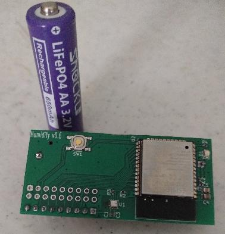
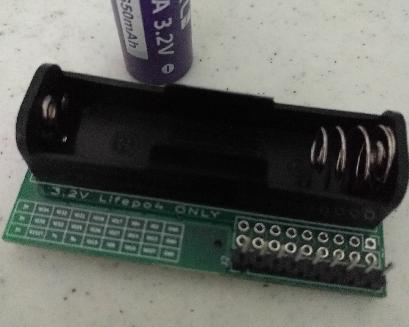
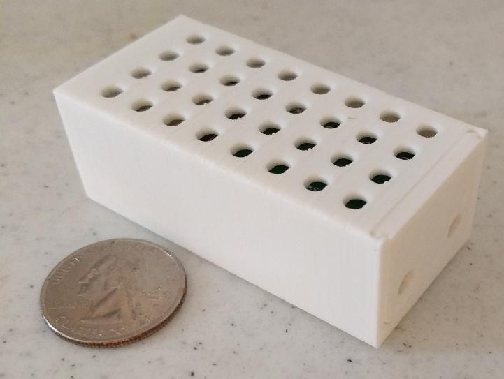

This is an experimental pcb design for a battery powered wireless
humidity, temperature, and pressure sensor. It uses an esp32 wifi chip
along with a bme280 sensor.

This is an experiment. There is no support for this project.

There is some information on the pcb design in the
[pcb document](docs/PCB.md).

There is some information on building the firmware in the
[firmware document](docs/Firmware.md).
