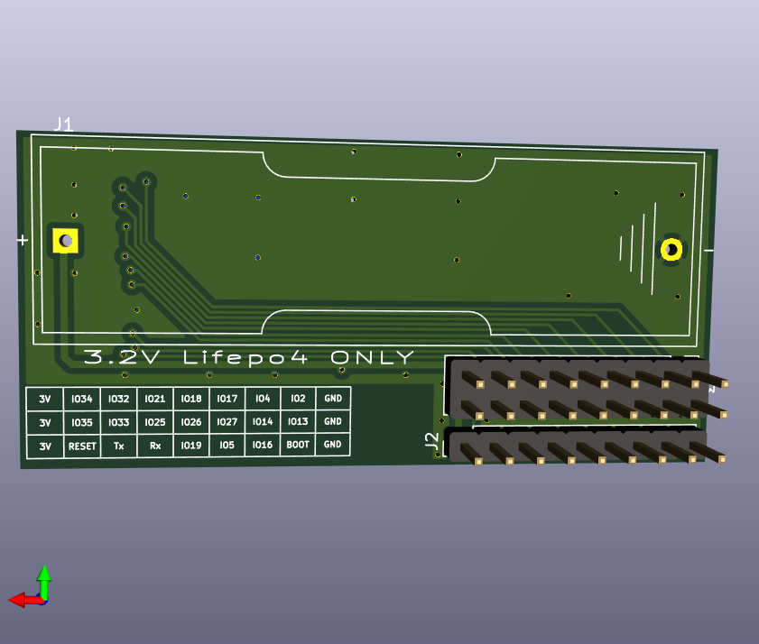

The PCB design files can be found in the [pcb/](../pcb/) directory.
The boards were designed using [KiCad](https://kicad-pcb.org/) and
manufactured using [JLC PCB](https://jlcpcb.com/).

The board is designed to use a 3.2V LiFePO4 battery. The device will
not function properly with a 3.7V Lithium battery nor with a regular
alkaline AA battery - inserting an incorrect battery is likely to
permanently damage the board and it may result in a fire hazard.

Case
====

The design for a plastic case can be found in the [case/](../case/)
directory. It can be printed using a 3d-printer. The case was designed
using [OpenSCAD](https://www.openscad.org/).
